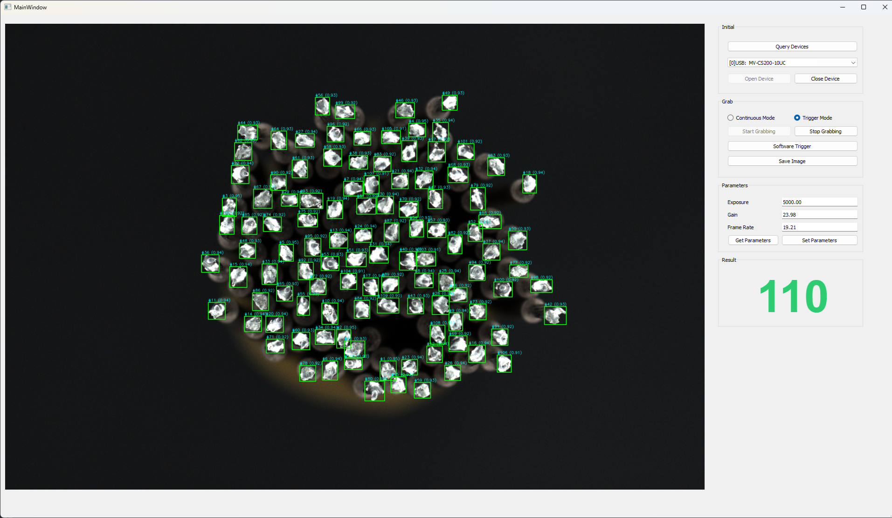

# 🧠 YOLO-based Object Counting Windows Application using MVS SDK

A Windows desktop application for real-time object detection and counting using YOLO. The system integrates industrial cameras via the MVS SDK and provides a user-friendly interface built with Qt.

---

## 📌 Overview

This project is designed for real-time object counting in industrial and computer vision applications. It uses a YOLO-based deep learning model for fast and accurate object detection, combined with industrial camera input through the MVS SDK (DLL).

The application is built with Python and features a Qt-based graphical user interface (GUI), allowing users to monitor live video streams, visualize detections, and track object counts efficiently.

---

## 🚀 Features

* Real-time object detection and counting using YOLO
* Integration with industrial cameras via MVS SDK (DLL)
* Live video stream processing
* Bounding box visualization and counting overlay
* User-friendly GUI built with Qt
* Configurable detection parameters
* Exportable as a standalone `.exe` using PyInstaller

---

## 🛠️ Tech Stack

* Python
* YOLO (e.g., YOLOv5 / YOLOv8)
* OpenCV
* MVS SDK (DLL)
* PyQt / Qt
* PyInstaller

---

## 🏭 Use Cases

* Industrial production line counting
* Quality control and inspection
* Warehouse automation
* Smart monitoring systems

---

## 📂 Project Structure

```
project/
│
├── MvImport/                # Main source code
├── model.onnx             # YOLO model weights               # MVS SDK integration
├── BasicDemo.py             # Application entry point
├── CamOperation_class.py 
├── PyUICBasicDemo.py 
└── README.md
```

---

## ⚙️ Installation

### 1. Clone the repository

```
git clone https://github.com/khaihp98/YOLOCounter.git
```

### 2. Install dependencies

```
pip install -r requirements.txt
```

### 3. Setup MVS SDK

* Install the MVS SDK from your camera vendor
* Ensure required DLL files are accessible (added to PATH or project directory)

### 4. Add your custom model file

* model.onnx

---

## ▶️ Usage

Run the application:

```
python BasicDemo.py
```

Steps:

1. Connect to the camera
2. Start the video stream or trigger mode

---

## 📦 Build Executable (Windows)

Package the application into a standalone `.exe`:

```
pyinstaller BasicDemo.py --windowed --runtime-hook hook-onnxruntime.py --add-binary="C:\Program Files (x86)\Common Files\MVS\Runtime\Win64_x64\*.dll;." --add-data="model.onnx;."
```

> Note: You may need to include additional DLL files (e.g., MVS SDK) when building.

---

## 📷 Demo



---

## ⚠️ Notes

* Ensure your hardware meets YOLO performance requirements
* Camera compatibility depends on MVS SDK version
* Real-time performance varies based on CPU/GPU

---

## 📜 License

Apache License 3.0
